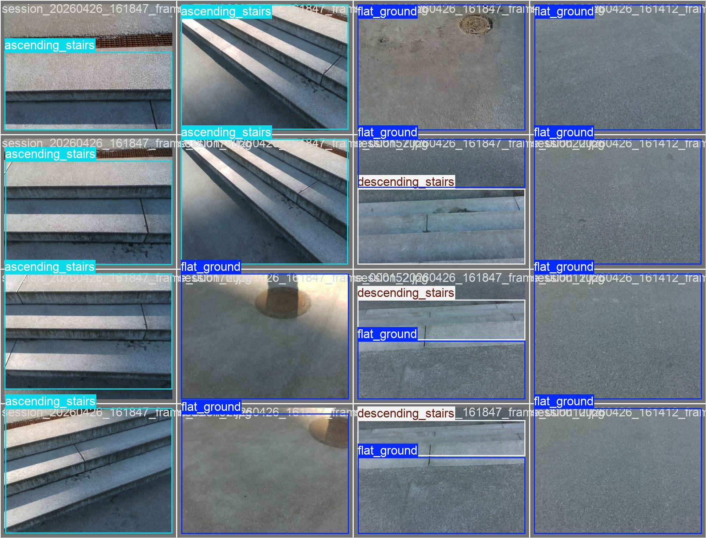

# ExoVision
This project contains the scripts and utilities required to install, run, and evaluate a computer vision model for stair detection. The system processes RGB and depth data from an Intel RealSense or the actual used camera to detect stairs and communicates the detection results through a gRPC interface.

The project includes:

- Data collection and loading utilities for RealSense RGB and depth frames.
- Preprocessing and visualization tools for captured data.
- Stair detection model inference scripts.
- gRPC server and client implementations for transmitting stair detection results to external applications.
- Installation and setup scripts for deploying the system in a new environment.

The output of the model includes stair detection status and associated information, which can be consumed by other systems through the gRPC API.
The dataset is provided in Teams as a ZIP archive named `data`.




# Download Tailscale and log in
Login information is found in Teams - tailscale email information
```bash
curl -fsSL https://tailscale.com/install.sh | sh
sudo tailscale up
```

### Build environment:
```bash
python3.10 -m venv venv
source venv/bin/activate
pip install --upgrade pip setuptools wheel
pip install -r requirements.txt
```
### Export variables:
Fill the information in the .env file
#### Server side:
```bash
export ROLE=receiver
```
#### Sender side:
```bash
export ROLE=sender
```
#### HOST:
```bash
export DENMARK_HOST="hostname of PC locked into tailscale can also be found on the tailscale login"
```

### Run scripts:
```bash
chmod +x run.sh
bash run.sh
```
If the `sh` script does not work run: 
```bash
python scripts/main.py
```

## Scripts

Different scripts in this workspace are used for training models, visualization, testing, and data handling. These are organized into two main areas:

- `training/` → contains scripts for model training, data processing, and dataset utilities  
- `scripts/` → contains the main runtime and application scripts

---

### Main Scripts

- `main.py`  
  Entry point of the system. Loads and runs the appropriate script based on environment variables defined in the `.env` file.

- `sender.py`  
  Client-side script used to send image data to the gRPC server. A separate ROS-based version is intended for deployment, while this version is used for local testing.

- `receiver.py`  
  gRPC server that receives image data, runs inference using the stair detection model, and returns predictions including stair class, confidence, and distance (with future support for step counting).

- `vision.proto`  
  Defines the gRPC communication interface, including message formats and service structure.

- `stair_config.json`  
  Configuration file containing adjustable thresholds and parameters for stair detection and system behavior.

---
### Training Scripts

- `train.py`  
  Main training script used for training the model, including hyperparameter configuration and experiment setup.

- `raw_collector.py`  
  Used for collecting RealSense data. Supports recording data in segments during data acquisition sessions.

- `data_mover.py`  
  Moves collected data into structured directories for labeling and processing.

- `cleanup_unlabeled.py`  
  Removes or filters out unlabeled or incomplete data samples.

- `split_dataset.py`  
  Splits the dataset into training, validation, and test sets for model training.

If newer models are trained the weights shall be placed in `scripts/models`. 

## If code is changed generate code for gRPC
```bash
cd scripts
# -I. includes current directory, --python_out=. outputs generated protobuf code, --grpc_python_out=. outputs gRPC stubs
python -m grpc_tools.protoc -I. --python_out=. --grpc_python_out=. vision.proto
cd ..
```

## Data collection command:
To label more data, place the `data` folder in the root directory of the environment and run the following command:
```bash 
labelImg data/processed/train/images data/processed/train/labels/classes.txt
```
To visualize data in samples use script `data/data_visualizer.py`

## Model Weight Update Strategies

| Approach | Pros | Cons | Best For |
|----------|------|------|----------|
| **Atomic Swap** | Simple, fast | Doubles memory briefly | Jetson (small models) |
| **Versioning** | Robust, checksum verify | More code | Production systems |
| **Read-Write Lock** | Fine-grained control | Complex, can block reads | High-concurrency systems |

**Recommendation for Jetson:** Use Atomic Swap - loads new model completely before acquiring lock, then swaps in microseconds. Inference never pauses.
